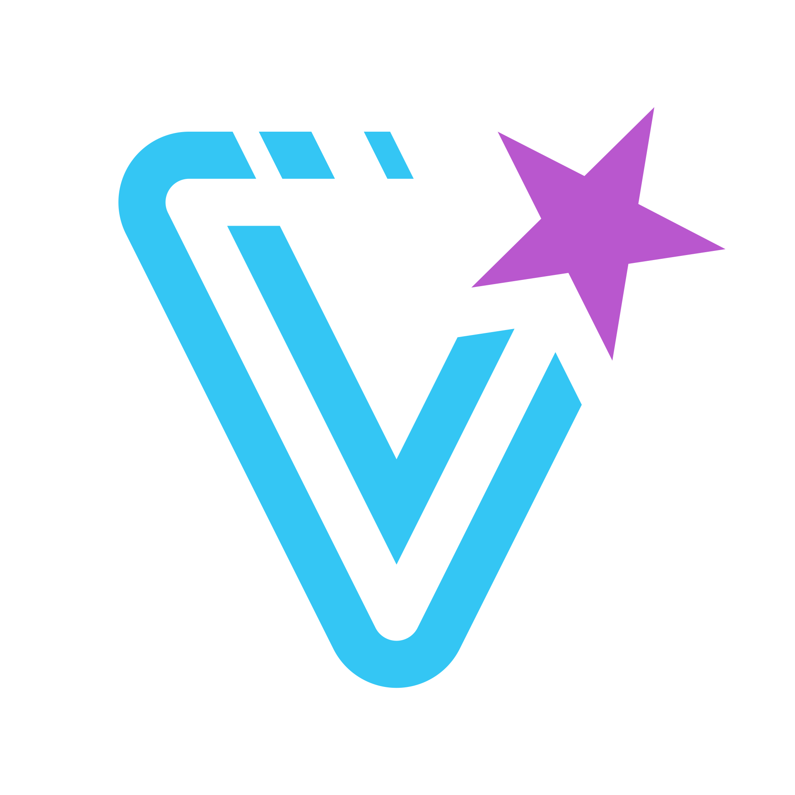

# Vela Logo

<p style="text-align:center;"></p>

## Introduction

The word Vela (pronounced _VEE-luh_) is based on the namesake [star constellation](<https://en.wikipedia.org/wiki/Vela_(constellation)>) and is the Latin word for the sails of a ship.

The logo shape is a stylized version of the letter "v" with an angled star above the right arm of the "v". In the negative space of the right arm and star there is an arrow pointing to the north-east leading into the star.

In addition to representing the initial letter of Vela, the logo mark symbolizes the journey of a project (the star) through Vela. Beginning with the implied motion marks at the top center and moving counter-clockwise, each corner signifies stages of a pipeline that the project navigates until it is completed or launched, culminating in the star shooting off into space.

## Logo Colors

The logo consists of two colors. The general "v" shape has a sky blue color, while the star uses a violet, orchid color.

The blue represents trust, reliability, and the "boring" technology that powers Vela.

The orchid color represents the tasks or projects that utilize Vela. They are the exciting, creative project that Vela propels through their required pipeline flows.

The colors work equally well on light or dark backgrounds.

Note: the colors were chosen as digital-first (not CMYK gamut). As such, expect that the star color will be a bit duller on printed materials. Try using the Pantone&reg; version (see [Logo Files](#logo-files) section), where possible, as it _should_ match colors more closely. Ideally request physical proofs from the printer when possible.


### Sky Blue


|         | Value                   |
| ------- | ----------------------- |
| Hex     | `#34c6f4`               |
| RGB     | `52, 198, 244`          |
| HSL     | `194, 89.7%, 58.0%`     |
| OKLCH   | `77.17%, 0.134, 224.52` |
| CMYK    | `62, 0, 0, 0`           |
| Pantone | `298 C`                 |

### Orchid


|         | Value                  |
| ------- | ---------------------- |
| Hex     | `#b957ce`              |
| RGB     | `185,87,206`           |
| HSL     | `289, 54.8%, 57.5%`    |
| OKLCH   | `62.4%, 0.194, 320.25` |
| CMYK    | `39, 86, 0, 0`         |
| Pantone | `2582 C`               |

## Logo Files

The logo files are divided into digital and print files and are provided in various formats.

For digital files the most common/recommended formats are added at the top level. A "/more" folder provides additional formats and sizes where applicable, for convenience.

All assets were created using Affinity Designer (and the source files are provided with `.afdesign` extension). However, with the provided vector formats (such as .svg), the "source" is essentially provided without the need for specific software.

Where applicable each asset type has been optimized to provide the smallest filesize.

### File List

```
.
├── digital
│  ├── black
│  │  ├── more
│  │  │  ├── vela-black.gif
│  │  │  ├── vela-black.jpg
│  │  │  ├── vela-black.pdf
│  │  │  ├── vela-black.webp
│  │  │  ├── vela32-black.png
│  │  │  ├── vela64-black.png
│  │  │  ├── vela128-black.png
│  │  │  ├── vela512-black.png
│  │  │  └── vela@3x-black.png
│  │  ├── vela-black.afdesign
│  │  ├── vela-black.png
│  │  └── vela-black.svg
│  ├── full-color
│  │  ├── more
│  │  │  ├── vela.gif
│  │  │  ├── vela.jpg
│  │  │  ├── vela.pdf
│  │  │  ├── vela.webp
│  │  │  ├── vela32.png
│  │  │  ├── vela64.png
│  │  │  ├── vela128.png
│  │  │  ├── vela512.png
│  │  │  └── vela@3x.png
│  │  ├── vela.afdesign
│  │  ├── vela.png
│  │  └── vela.svg
│  └── white
│     ├── more
│     │  ├── vela-white.gif
│     │  ├── vela-white.pdf
│     │  ├── vela-white.webp
│     │  ├── vela32-white.png
│     │  ├── vela64-white.png
│     │  ├── vela128-white.png
│     │  ├── vela512-white.png
│     │  └── vela@3x-white.png
│     ├── vela-white.afdesign
│     ├── vela-white.png
│     └── vela-white.svg
├── print
│  ├── cmyk
│  │  ├── vela-cmyk.afdesign
│  │  ├── vela-cmyk.eps
│  │  ├── vela-cmyk.pdf
│  │  └── vela-cmyk.tiff
│  └── pantone
│     ├── vela-pantone.afdesign
│     ├── vela-pantone.eps
│     ├── vela-pantone.pdf
│     └── vela-pantone.tiff
```
