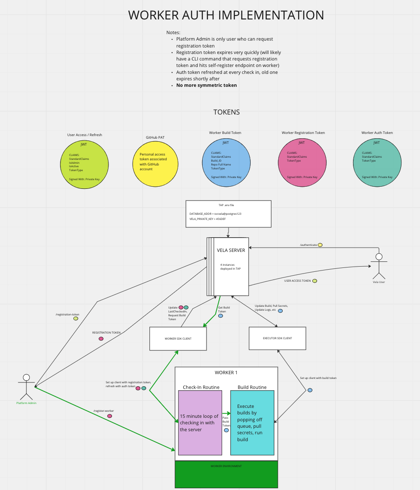

# Enhanced Worker Authentication

<!--
The name of this markdown file should:

1. Short and contain no more then 30 characters

2. Contain the date of submission in MM-DD format

3. Clearly state what the proposal is being submitted for
-->

| Key           | Value                                                                                |
| :-----------: | :----------------------------------------------------------------------------------: |
| **Author(s)** | Easton.Crupper, David.Vader, David.May, Tim.Huyn, Kelly.Merrick                      |
| **Reviewers** |                                                                                      |
| **Date**      | February 22nd, 2023                                                                  |
| **Status**    | In Progress                                                                          |

<!--
If you're already working with someone, please add them to the proper author/reviewer category.

If not, please leave the reviewer category empty and someone from the Vela team will assign it to themself.

Here is a brief explanation of the different proposal statuses:

1. Reviewed: The proposal is currently under review or has been reviewed.

2. Accepted: The proposal has been accepted and is ready for implementation.

3. In Progress: An accepted proposal is being implemented by actual work.

NOTE: The design is subject to change during this phase.

4. Cancelled: While or before implementation the proposal was cancelled.

NOTE: This can happen for a multitude of reasons.

5. Complete: This feature/change is implemented.
-->

## Background

<!--
This section is intended to describe the new feature, redesign or refactor.
-->

**Please provide a summary of the new feature, redesign or refactor:**

<!--
Provide your description here.
-->

With the implementation of the `internal/token` package in the `v0.18.0` release, there is an opportunity to further improve the security of worker-server communication. As it stands today, the worker uses a symmetric token (worker: `VELA_SERVER_SECRET`, server: `VELA_SECRET`) to authenticate the [check-in routine](https://github.com/go-vela/worker/blob/main/cmd/vela-worker/register.go). 

This document is a proposal to utilize the recently introduced `internal/token` package to mint and validate worker auth tokens and include a registration process to introduce significant friction for potential attackers.

In short, the Vela platform administrators will have the ability to register workers with a registration token, and the worker will maintain its authenticity by performing a check-in at a specified interval, where it will present its authentication token and receive a new one. The details of this will all be included below, in the [Design](02-22_worker-authentication.md#design) section.

**Please briefly answer the following questions:**

1. Why is this required?

<!-- Answer here -->

In the current implementation, the server-worker symmetric token has no expiration and is not encrypted in any way. 

If a bad actor were to gain access to the host on which the Vela worker is run, they could read from the docker environment and use the symmetric secret to request build tokens, update worker information, and spin up new workers of their own.

2. If this is a redesign or refactor, what issues exist in the current implementation?

<!-- Answer here -->

Mentioned in question 1

3. Are there any other workarounds, and if so, what are the drawbacks?

<!-- Answer here -->

While there may be other forms of authentication available for the server and worker, there already exists the infrastructure to use JWT tokens with claims on expiration, token type, etc.

4. Are there any related issues? Please provide them below if any exist.

<!-- Answer here -->

N/A

## Design

<!--
This section is intended to explain the solution design for the proposal.

NOTE: If there are no current plans for a solution, please leave this section blank.
-->

**Please describe your solution to the proposal. This includes, but is not limited to:**

* new/updated endpoints or url paths
* new/updated configuration variables (environment, flags, files, etc.)
* performance and user experience trade-offs
* security concerns or assumptions
* examples or (pseudo) code snippets

<!-- Answer here -->

This diagram should provide a general overview of the design.

### Server Design

With the implementation of the token manager and build tokens, the ground work is already present to mint and validate worker auth tokens.

Some of the major changes will be:

- Add the ability for the `internal/token` package to mint and validate worker auth / register tokens
- Add a `GET` registration endpoint, which will be platform admin exclusive. It will return a worker registration token.
- Enhance the current `MustWorker` permissions check to use claims from a worker auth token rather than the symmetric secret.
- Place the `POST` and `PUT` worker endpoints behind that improved permissions check. (note: the `PUT` endpoint will accept both registration and auth tokens in order to account for re-registration in the event the worker was offline and is still in the database).

### Worker Design

The worker design is more tricky, but will look something like this:

- On start up, the worker will check to see if it has a registration token. If not, it will enter a dead loop, where it will do nothing (no pulling from queue, checking in, etc) except serve the worker API. If it does have a registration token, it will perform its check-in process and continue operations.
- During the check in process, the worker will exchange its registration token for an auth token, which it will then refresh on the check-in interval.
- A new endpoint to self-register will be added. This endpoint will take a registration token and use it to break the dead loop and continue with check-in and building.
- In a scenario where a worker loses connection for a certain time period that renders the auth token expired, and admin is require to re-register the worker

Other considerations to further improve security:
- specification of IP address in the claims to allow restriction by IP
- stricter expiration logic

### CLI Design

Since the registration token is so quick to expire, it is important to automate the job of onboarding workers for platform admins. This means that a new CLI command will be added that will use platform admin credentials to retrieve a registration token and hit the worker self-register endpoint. This will be vital for use in automation tools.

## Decision: Opt-In or Required?

Given that there is a significant increase in overhead for onboarding a worker, I wanted to pose the question to the community: do we want to make this opt-in? The design for opt-in would basically be to use the symmetric token if provided for worker check-in / registration. In other words, if a worker has a value for `VELA_SERVER_SECRET`, then the server will honor that so long as it also has the same value in `VELA_SECRET` for all worker check-in related routines.

## Implementation

<!--
This section is intended to explain how the solution will be implemented for the proposal.

NOTE: If there are no current plans for implementation, please leave this section blank.
-->

- The server secret would be dropped from the container environment altogether.
- All auth tokens (check in + registration) have a strict expiration.
- Registration tokens can only be generated by a platform administrator
- Registration tokens expire very quickly

**Please briefly answer the following questions:**

1. Is this something you plan to implement yourself?

<!-- Answer here -->

Yes, with help

2. What's the estimated time to completion?

<!-- Answer here -->

1-3 weeks, pending discussion

**Please provide all tasks (gists, issues, pull requests, etc.) completed to implement the design:**

<!-- Answer here -->

## Questions

ICYMI, please see my question [above](02-22_worker-authentication#decision-opt-in-or-required)