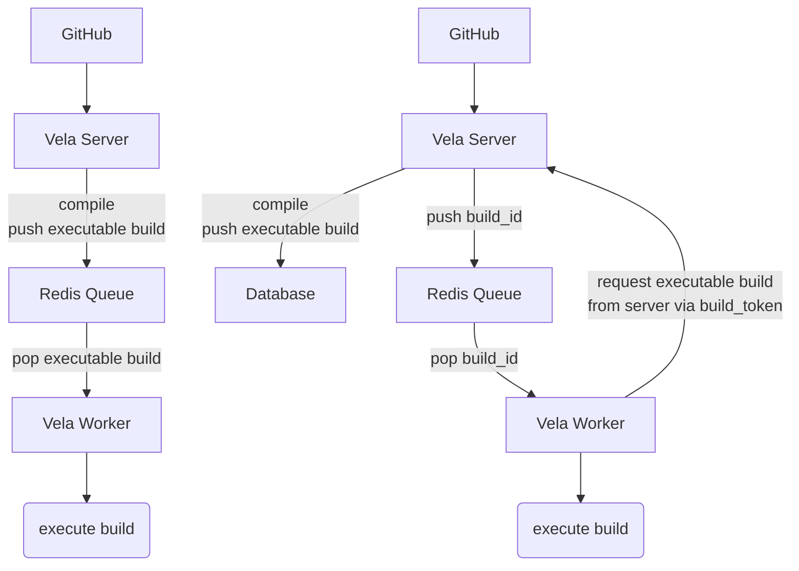

# Limiting Queue Sensitivity

<!--
The name of this markdown file should:

1. Short and contain no more then 30 characters

2. Contain the date of submission in MM-DD format

3. Clearly state what the proposal is being submitted for
-->

| Key           | Value                                                                                                |
| :-----------: | :--------------------------------------------------------------------------------------------------: |
| **Author(s)** | David.Vader                                                                                          |
| **Date**      | May 11th, 2023                                                                                      |
| **Status**    | Under Review                                                                                         |

<!--
If you're already working with someone, please add them to the proper author/reviewer category.

If not, please leave the reviewer category empty and someone from the Vela team will assign it to themself.

Here is a brief explanation of the different proposal statuses:

1. Reviewed: The proposal is currently under review or has been reviewed.

2. Accepted: The proposal has been accepted and is ready for implementation.

3. In Progress: An accepted proposal is being implemented by actual work.

NOTE: The design is subject to change during this phase.

4. Cancelled: While or before implementation the proposal was cancelled.

NOTE: This can happen for a multitude of reasons.

5. Complete: This feature/change is implemented.
-->

## Background

<!--
This section is intended to describe the new feature, redesign or refactor.
-->

**Please provide a summary of the new feature, redesign or refactor:**

<!--
Provide your description here.
-->

This proposal is small piece to a larger effort to increase the overall security of the platform.

The problem being solved is that the Redis queue is currently a potential attack vector with direct regard to the information compiled in plaintext into the executable pipeline build object, namely the `NETRC_PASSWORD` placed in the environment.

The feature proposed is a modification to what data the server places directly on the queue and to offload the potentially sensitive executable pipeline build to a table in the database that must be requested when the build is ready for execution. The server would enqueue only the build's ID, which the worker would pop from the queue. The worker would use a minted build token to retrieve the executable pipeline build, increasing the work required to compromise a repo owner's token in the event of a worker compromise. This should not impact the functionality of the platform, and is moreso a security-driven improvement to decrease Redis' potential as an attack vector.

The main advantage to this approach would be that the `NETRC_PASSWORD` is no longer stored on the Redis queue at any point in the build execution workflow.


**Please briefly answer the following questions:**

1. Why is this required?

<!-- Answer here -->

* improves security by removing potentially sensitive pipeline information from the queue
* takes a greater "dumb worker" approach by giving them less direct-access to potentially sensitive data
* moves access to sensitive pipeline information behind the worker auth & build token process

1. If this is a redesign or refactor, what issues exist in the current implementation?

<!-- Answer here -->

The current queue implementation involves placing sensitive pipeline information like the user token in Redis, and the worker depends on this information being present to properly execute builds.


1. Are there any other workarounds, and if so, what are the drawbacks?

<!-- Answer here -->

It's possible to improve security around the queue in other ways, like using a [READONLY](https://redis.io/commands/readonly/) replica, though it doesn't improve the sensitivity of the data that can be read.

We could also look into GitHub Apps to limit the blast radius if the queue were compromised as an attack vector.

1. Are there any related issues? Please provide them below if any exist.

<!-- Answer here -->

Indirect: https://github.com/go-vela/community/issues/804

## Design

<!--
This section is intended to explain the solution design for the proposal.

NOTE: If there are no current plans for a solution, please leave this section blank.
-->

**Please describe your solution to the proposal. This includes, but is not limited to:**

* new database table to store interim executable builds
* new endpoint to retrieve a executable build from the server
* modification to the [Item](https://github.com/go-vela/types/blob/main/item.go#L12C1-L18) currently placed on the queue to only push build ID
* modification to webhook processing to push the executable build to a separate table
* added interaction between worker and server to request an executable build

<!-- Answer here -->

For reference please review the following design diagram that explains the approach from a high level.



New functionality that is absolutely required:

#### Server

- GET `api/v1/<org>/<repo>/build/<number>/executable` or `api/v1/search/builds/<id>/executable` to retrieve an executable pipeline build using a build token
- `database/executable-build` package and a new database table `executable_build` that will contain serialized executable pipeline builds in bytes, formerly stored directly on the Redis queue.
- separate database row creation in addition to the Redis [Item](https://github.com/go-vela/types/blob/main/item.go#L12C1-L18) push


#### Worker

- should perform a GET `api/v1/<org>/<repo>/build/<number>/executable` or `api/v1/search/builds/<id>/executable` to retrieve an executable pipeline build using a build token

#### Types

Removing the `pipeline.Build` from the `Item` published to the queue, which represents the "executable pipeline build" (aka "executable build").

```diff
// Item is the queue representation of an item to publish to the queue.
type Item struct {
	Build    *library.Build  `json:"build"`
-	Pipeline *pipeline.Build `json:"pipeline"`
	Repo     *library.Repo   `json:"repo"`
	User     *library.User   `json:"user"`
}
```

## Implementation

<!--
This section is intended to explain how the solution will be implemented for the proposal.

NOTE: If there are no current plans for implementation, please leave this section blank.
-->

**Please briefly answer the following questions:**

1. Is this something you plan to implement yourself?

<!-- Answer here -->

Yes

2. What's the estimated time to completion?

<!-- Answer here -->

3-4 days

**Please provide all tasks (gists, issues, pull requests, etc.) completed to implement the design:**

<!-- Answer here -->


## Questions

**Please list any questions you may have:**

<!-- Answer here -->

N/A
