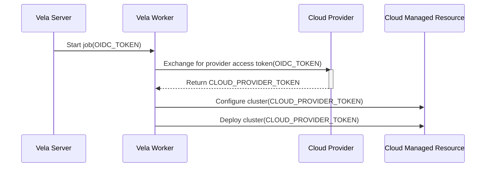

# Build Tokens

| Key           |                               Value                               |
| :-----------: |:-----------------------------------------------------------------:|
| **Author(s)** | Easton Crupper, David Vader, Dan Tanner                           |
| **Reviewers** |                                                                   |
| **Date**      |                         May 10th, 2024                            |
| **Status**    |                            Reviewed                               |

## Background

Today, people using private infrastructure typically store enterprise-managed credentials in Vela to access company systems in the CI workflow.
For every system accessed in every workflow, an account with access must be provisioned and stored in multiple places, 
There are some serious negative consequences as a result:
- labor costs and time to market are increased due to the steps needed to configure and manage the accounts
- security risks are increased with static passwords being stored in additional systems being the system of record
- outage risks are increased as passwords are rotated or expire

OpenID Connect (OIDC) is a technology that can address all of these issues. In a CI system, short-lived OIDC tokens (implemented as JWT tokens) are created
for each build, and each cloud provider authenticates the token with the Vela server. The OIDC token allows for fine-grained authorization with
access to build information like repository organization, repository, author, event type, etc..

**Please provide a summary of the new feature, redesign or refactor:**

Support the OpenID Connect specification in Vela, allowing it to perform the role of OIDC Provider. [Specification implementor's guide](https://openid.net/specs/openid-connect-basic-1_0.html)

The following diagram shows an example flow:

**Please briefly answer the following questions:**

1. Why is this required?

The end result is that people using Vela can access resources without needing to maintain credentials, yet the information exchange is still strongly authenticated and authorized.
This increases productivity, strengthens security, and eliminates outages caused by expired or incorrect credentials.

2. If this is a redesign or refactor, what issues exist in the current implementation?

N/A

3. Are there any other workarounds, and if so, what are the drawbacks?

This is a new feature. Users would still be able to use the existing password management features.

4. Are there any related issues? Please provide them below if any exist.

## Design

TODO

**Please describe your solution to the proposal. This includes, but is not limited to:**

TODO

## Implementation

TODO

**Please briefly answer the following questions:**

1. Is this something you plan to implement yourself?

2. What's the estimated time to completion?

**Please provide all tasks (gists, issues, pull requests, etc.) completed to implement the design:**

## Questions
