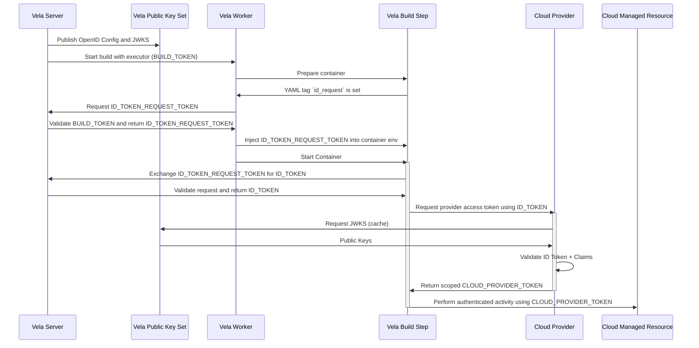

# Build Tokens

| Key           |                               Value                               |
| :-----------: |:-----------------------------------------------------------------:|
| **Author(s)** | Easton Crupper, David Vader, Dan Tanner                           |
| **Reviewers** |                                                                   |
| **Date**      |                         May 10th, 2024                            |
| **Status**    |                            Reviewed                               |


## Background

Today, people using private infrastructure typically store enterprise-managed credentials in Vela to access company systems in the CI workflow.
For every system accessed in every workflow, an account with access must be provisioned and stored in multiple places, 
There are some serious negative consequences as a result:
- labor costs and time to market are increased due to the steps needed to configure and manage the accounts
- security risks are increased with static passwords being stored in additional systems being the system of record
- outage risks are increased as passwords are rotated or expire

OpenID Connect (OIDC) is a technology that can address all of these issues. In a CI system, short-lived OIDC tokens (implemented as JWT tokens) are created
for each build, and each cloud provider authenticates the token with the Vela server. The OIDC token allows for fine-grained authorization with
access to build information like repository organization, repository, author, event type, etc..


**Please provide a summary of the new feature, redesign or refactor:**

Support the OpenID Connect specification in Vela, allowing it to perform the role of OIDC Provider. [Specification implementor's guide](https://openid.net/specs/openid-connect-basic-1_0.html)

The following diagram shows an example flow:


**Please briefly answer the following questions:**

1. Why is this required?

The end result is that people using Vela can access resources without needing to maintain credentials, yet the information exchange is still strongly authenticated and authorized.
This increases productivity, strengthens security, and eliminates outages caused by expired or incorrect credentials.

2. If this is a redesign or refactor, what issues exist in the current implementation?

N/A

3. Are there any other workarounds, and if so, what are the drawbacks?

This is a new feature. Users would still be able to use the existing password management features.

4. Are there any related issues? Please provide them below if any exist.


## Design

**Example Pipeline**

High level, this would be the necessary first step to receive an ID token for any Vela build.

```yaml
version: "1"

steps:
  - name: request token
    image: alpine:latest
    id_request: write  # becomes a claim in token `request`
    commands:
      - apk add curl
      - 'curl -H "Authorization: Bearer $VELA_ID_TOKEN_REQUEST_TOKEN" $VELA_ID_TOKEN_REQUEST_URL'
```


**New Token Types**

### ID_TOKEN_REQUEST_TOKEN

Token is signed by _VELA_SERVER_PRIVATE_KEY_ using HS256 algorithm. It has the following claims:

```json
{
  "build_id": 1,
  "build_number": 1,
  "build_sender": "EastonCrupper",
  "repo": "EastonCrupper/myvela",
  "token_type": "IDRequest",
  "image": "alpine:latest",
  "request": "write",
  "sub": "repo:<repo_full_name>:ref:<build_ref>:<build_event>",
  "exp": 1714586259,
  "iat": 1714584159
}
```

The token is injected into any step that requests it: `id_request: <anything>`. The worker will use the executor build token to retrieve the `ID_TOKEN_REQUEST_TOKEN`:
```go
// WORKER CODE — PlanStep
	var requestToken string

	if len(ctn.IDRequest) > 0 {
		opts := vela.RequestTokenOptions{
			Image:   ctn.Image,
			Request: ctn.IDRequest,
		}

		tkn, _, err := c.Vela.Build.GetIDRequestToken(c.build.GetRepo().GetOrg(), c.build.GetRepo().GetName(), c.build.GetNumber(), opts)
		if err != nil {
			return err
		}

		requestToken = tkn.GetToken()
	}

	// update the step container environment
	//
	// https://pkg.go.dev/github.com/go-vela/worker/internal/step#Environment
	err = step.Environment(ctn, c.build, _step, c.Version, requestToken)
	if err != nil {
		return err
	}
```

The token will then be minted with the image and `id_request` value as claims. This presents further opportunity for security checks from services, as these claims are translated to the ID token.

Retrieving the token involves hitting the endpoint $VELA_ID_TOKEN_REQUEST_URL (/api/v1/repos/ORG/REPO/builds/BUILD/id_token). This environment variable is injected at compile time just like other platform level env variables.

Upon hitting that endpoint, the server will validate a few things:

- The token is the expected token type
- The build is the expected build (build_id)
- The token is not expired
- The token has indeed been signed by the Vela server
- The associated build is actively running (leaked request tokens are not vulnerable post build).

```go
// router/build.go
b.GET("/id_token", perm.MustIDRequestToken(), build.GetIDToken)

// router/middleware/perm/perm.go
func MustIDRequestToken() gin.HandlerFunc {
	return func(c *gin.Context) {
		cl := claims.Retrieve(c)
		b := build.Retrieve(c)

		// update engine logger with API metadata
		//
		// https://pkg.go.dev/github.com/sirupsen/logrus?tab=doc#Entry.WithFields
		logrus.WithFields(logrus.Fields{
			"repo": cl.Subject,
		}).Debugf("verifying worker %s has a valid build token", cl.Subject)

		// verify expected type
		if !strings.EqualFold(cl.TokenType, constants.IDRequestTokenType) {
			retErr := fmt.Errorf("invalid token: must provide a valid request ID token")
			util.HandleError(c, http.StatusUnauthorized, retErr)

			return
		}

		// if build is not in a running state, then an ID token should not be needed
		if !strings.EqualFold(b.GetStatus(), constants.StatusRunning) {
			util.HandleError(c, http.StatusBadRequest, fmt.Errorf("invalid request"))

			return
		}

		// verify expected build id
		if b.GetID() != cl.BuildID {
			logrus.WithFields(logrus.Fields{
				"user":  cl.Subject,
				"repo":  cl.Repo,
				"build": cl.BuildID,
			}).Warnf("request ID token for build %d attempted to be used for %s build %d by %s", cl.BuildID, b.GetStatus(), b.GetID(), cl.Subject)

			retErr := fmt.Errorf("invalid token")
			util.HandleError(c, http.StatusUnauthorized, retErr)
		}
	}
}
```


### ID TOKEN

This token is signed by an RSA private key that is generated by the server. The corresponding public key is converted to a JWK and stored in the database. The key pair is assigned a KID to distinguish which server instance generated a token. The private keys are not stored.

```go
// GenerateRSA creates an RSA key pair and sets it in the token manager and saves the JWK in the database.
func (tm *Manager) GenerateRSA(db database.Interface) error {
	// generate key pair
	privateRSAKey, err := rsa.GenerateKey(rand.Reader, 2048)
	if err != nil {
		return err
	}

	// assign KID to key pair
	kid, err := uuid.NewV7()
	if err != nil {
		return err
	}

	// abstract the JWK from the public key information
	key := api.JWK{
		Algorithm: jwt.SigningMethodRS256.Name,
		Kid:       kid.String(),
		Use:       "sig",
		Kty:       "RSA",
		N:         base64.RawURLEncoding.EncodeToString(privateRSAKey.PublicKey.N.Bytes()),
		E:         base64.RawURLEncoding.EncodeToString([]byte(strconv.Itoa(privateRSAKey.PublicKey.E))),
	}

	// create the JWK in the database
	err = db.CreateJWK(context.TODO(), key)
	if err != nil {
		return err
	}

	// create the RSA key set for token manager
	keySet := RSAKeySet{
		PrivateKey: privateRSAKey,
		KID:        kid.String(),
	}

	tm.RSAKeySet = keySet

	return nil
}
```

The JWKS endpoint returns a set of keys at the path `/_services/token/.well-known/jwks`:
```go
// API Handler
func GetJWKS(c *gin.Context) {
	// retrieve JWKs from the database
	keys, err := database.FromContext(c).ListJWKs(c)
	if err != nil {
		retErr := fmt.Errorf("unable to get key set: %w", err)
		util.HandleError(c, http.StatusInternalServerError, retErr)

		return
	}

	c.JSON(http.StatusOK, types.JWKS{Keys: keys})
}
```

Sample response:
```json
{
  "keys": [
    {
      "alg": "RS256",
      "use": "sig",
      "x5t": "",
      "kid": "7D7EF589-E9D0-4FB1-ACA8-6F15745CFB78",
      "kty": "RSA",
      "x5c": null,
      "n": "<base64 URL encoded modulus>",
      "e": "<base64 URL encoded exponent>"
    },
    {
      "alg": "RS256",
      "use": "sig",
      "x5t": "",
      "kid": "2A6F2D16-92DA-4500-AEA1-AD5E249AB7AC",
      "kty": "RSA",
      "x5c": null,
      "n": "<base64 URL encoded modulus>",
      "e": "<base64 URL encoded exponent>"
    }
  ]
}
```

The path to this endpoint can be found at the OpenID configuration, also published, at path `/_services/token/.well-known/openid-configuration`:

```json
{
  "issuer": "http://localhost:8080",
  "jwks_uri": "http://localhost:8080/_services/token/.well-known/jwks",
  "supported_claims": [
    "sub",
    "exp",
    "iat",
    "iss",
    "build_number",
    "build_sender",
    "image",
    "request",
    "repo",
    "token_type"
  ],
  "id_token_signing_alg_values_supported": [
    "RS256"
  ]
}
```
It is important that `supported_claims` is always up to date with ID tokens minted. This is further security on whether the token was generated by Vela.

Therefore, here is a sample claims set from an ID token:

```json
{
  "build_number": 1,
  "build_sender": "EastonCrupper",
  "repo": "EastonCrupper/myvela",
  "token_type": "ID",
  "image": "alpine:latest",
  "request": "write",
  "iss": "http://localhost:8080",
  "sub": "repo:EastonCrupper/myvela:ref:refs/heads/random:event:push",
  "exp": 1714584462,
  "iat": 1714584162
}
```

### Key Rotation

With the key pairs being generated in memory and only the public keys stored, rotation is vital to prevent issues and maintain security.

Rotation by Vela admins will cause all public keys in the database to be set to `inactive`, which will prompt the Vela token manager to generate a new pair.

```go
// API Handler
func RotateOIDCKeys(c *gin.Context) {
	logrus.Info("Admin: rotating keys for OIDC provider")

	// capture middleware values
	ctx := c.Request.Context()

	err := database.FromContext(c).RotateKeys(ctx)
	if err != nil {
		retErr := fmt.Errorf("unable to rotate keys: %w", err)
		util.HandleError(c, http.StatusInternalServerError, retErr)

		return
	}

	c.JSON(http.StatusOK, "keys rotated successfully")
}

// Database Func
func (e *engine) RotateKeys(_ context.Context) error {
	e.logger.Trace("rotating keysets in the database")

	k := types.JWK{}

	// remove inactive keys
	err := e.client.
		Table(constants.TableJWK).
		Where("active = ?", false).
		Delete(&k).
		Error
	if err != nil {
		return err
	}

	// set active keys to inactive
	err = e.client.
		Table(constants.TableJWK).
		Where("active = ?", true).
		Update("active", sql.NullBool{Bool: false, Valid: true}).
		Error
	if err != nil {
		return err
	}

	return nil
}
```

The JWKS endpoint will publish both active and inactive public keys. This ensures that rotation is not breaking, as current builds will be able to validate legitimacy of an ID token even if the corresponding private key is no longer active.

### Validating ID Token

Below is a small Go function that validates the Vela ID token. A few assumptions have been made in struct definitions and helper functions.

```go
func ParseClaims(token string) (*Claims, error) {
	claims := new(Claims) // match claims in Vela ID token + JWT Standard Claims

	// create a new JWT parser with validation on signing method and issuer
	p := jwt.NewParser(
		jwt.WithValidMethods(j.Config.Algorithms),
		jwt.WithIssuer(j.Config.Issuer),
	)

	// parse, validate, and verify the token and return the custom OIDC claims
	tkn, err := p.ParseWithClaims(token, claims, func(token *jwt.Token) (interface{}, error) {
		// extract the claims from the token
		claims = token.Claims.(*Claims)

		// capture KID header in OIDC token
		kid, ok := token.Header["kid"].(string)
		if !ok {
			return nil, fmt.Errorf("no kid header in token")
		}

		// variable to store matching key
		var matchingKey *JWK

		// iterate over keys in JWKS endpoint to find matching x5t header
        // JWKS is populated by hitting https://vela-server.company.com/_services/token/.well-known/openid-configuration
        // followed by the URL specified in `jwks_uri` in the OpenID Config
		for _, k := range j.JWKS.Keys {
			if k.Kid == kid {
				matchingKey = &k
				break
			}
		}

		if matchingKey == nil {
			return nil, fmt.Errorf("no matching key found")
		}

		// generate the public key using the modulus and exponent in matching JWKS key
		//
		// build the public key in order to URL decode the values of modulus / exponent
		rsaKey, err := parseRSAKey(matchingKey.N, matchingKey.E)
		if err != nil {
			return nil, err
		}

		return rsaKey, nil
	})

	if err != nil || !tkn.Valid {
		return nil, err
	}

	return claims, nil
}
```

This process would be expected of any service to validate a Vela ID token.

**Please describe your solution to the proposal. This includes, but is not limited to:**

TODO


## Implementation

TODO


**Please briefly answer the following questions:**

1. Is this something you plan to implement yourself?

2. What's the estimated time to completion?


**Please provide all tasks (gists, issues, pull requests, etc.) completed to implement the design:**


## Questions
